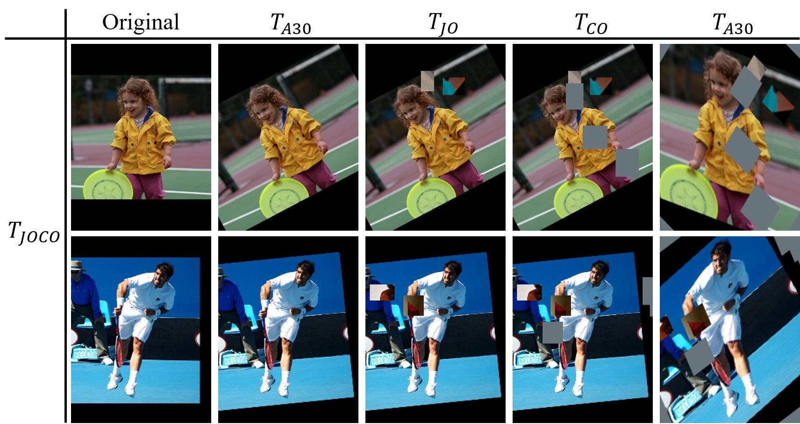
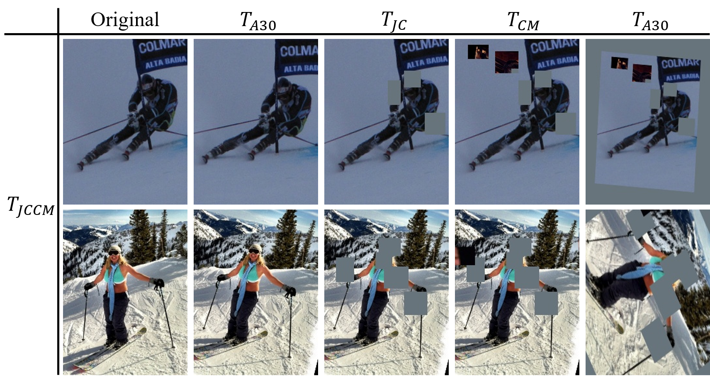
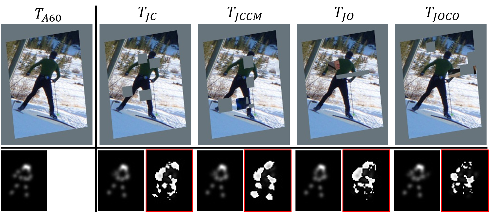
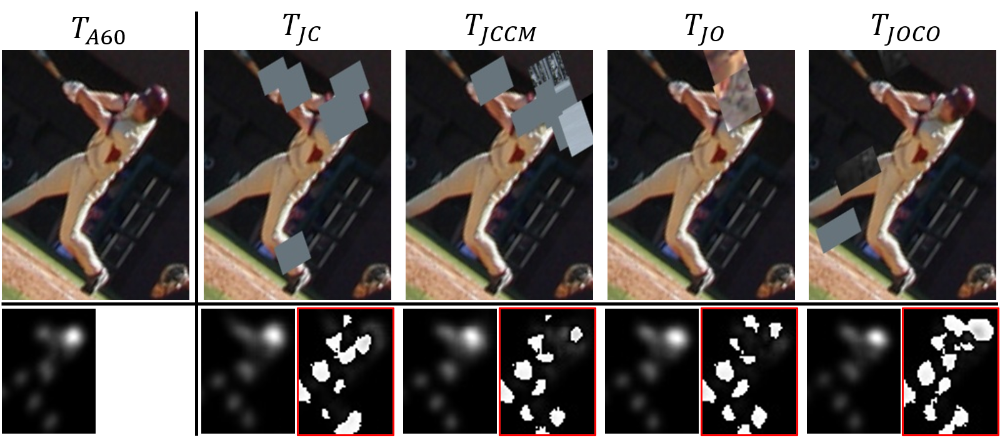

# MultiAugs
Code for my paper "Boosting Semi-Supervised 2D Human Pose Estimation by Revisiting Data Augmentation and Consistency Training"

## Abstract 
*The 2D human pose estimation is a basic visual problem. However, supervised learning of a model requires massive labeled images, which is expensive and labor-intensive. In this paper, we aim at boosting the accuracy of a pose estimator by excavating extra unlabeled images in a semi-supervised learning (SSL) way. Most previous consistency-based SSL methods strive to constraint the model to predict consistent results for differently augmented images. Following this consensus, we revisit two core aspects including **advanced data augmentation methods** and **concise consistency training frameworks**. Specifically, we heuristically dig various **collaborative combinations** of existing data augmentations, and discover novel superior data augmentation schemes to more effectively add noise on unlabeled samples. They can compose easy-hard augmentation pairs with larger transformation difficulty gaps, which play a crucial role in consistency-based SSL. Moreover, we propose to **strongly augment unlabeled images repeatedly with diverse augmentations**, generate multi-path predictions sequentially, and optimize corresponding unsupervised consistency losses using one single network. This simple and compact design is on a par with previous methods consisting of dual or triple networks. Undoubtedly, it can also be integrated with multiple networks to produce better performance. Comparing to state-of-the-art SSL approaches, our method brings substantial improvements on public datasets.*

## Brief Description
Our method `MultiAugs` contains two vital components: **new advanced collaborative augmentation combinations** and **multi-path predictions of strongly augment inputs with diverse augmentations**. Either of them can help to boost the performance of `Semi-Supervised 2D Human Pose Estimation`.

* **New advanced collaborative augmentation combinations:** We discover novel superior data augmentation schemes to more effectively add noise on unlabeled samples by sequentially executing ready-made augmentation combinations that produce synergistic effects. Below are two new superior augmentation combinations $T_{JOCO}$ and $T_{JCCM}$ recommended by us.

<table>
  <tr>
    <th>Illustration of new advanced $T_{JOCO}$</th>
    <th>Illustration of new advanced $T_{JCCM}$</th>
  </tr>
  <tr>
    <td></td>
    <td></td> 
  </tr>
</table>

* **Multi-path predictions of strongly augment inputs with diverse augmentations:** We also found that only using one single network, we can strongly augment unlabeled images repeatedly with diverse augmentations, generate multi-path predictions sequentially, and optimize corresponding unsupervised consistency losses at the same time.

<table>
  <tr>
    <th>Illustration of multi-heatmaps Case 1</th>
    <th>Illustration of multi-heatmaps Case 2</th>
  </tr>
  <tr>
    <td></td>
    <td></td> 
  </tr>
</table>

## 
