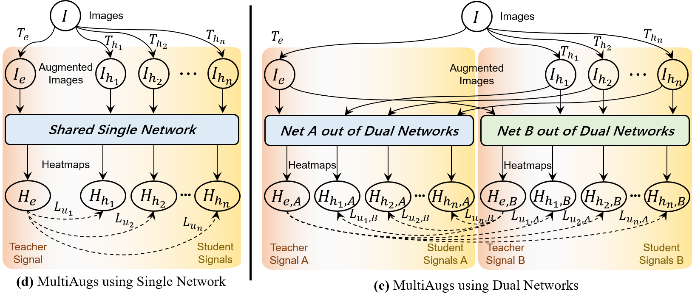

# MultiAugs
Code for my paper ***Boosting Semi-Supervised 2D Human Pose Estimation by Revisiting Data Augmentation and Consistency Training*** [arxiv 2024.02]

[[Arxiv Link](https://arxiv.org/abs/2024.07814)] | [[Released Models](https://huggingface.co/HoyerChou/MultiAugs)]

<p align="center"></p>

***

## ● Abstract 
*The 2D human pose estimation is a basic visual problem. However, supervised learning of a model requires massive labeled images, which is expensive and labor-intensive. In this paper, we aim at boosting the accuracy of a pose estimator by excavating extra unlabeled images in a semi-supervised learning (SSL) way. Most previous consistency-based SSL methods strive to constraint the model to predict consistent results for differently augmented images. Following this consensus, we revisit two core aspects including **advanced data augmentation methods** and **concise consistency training frameworks**. Specifically, we heuristically dig various **collaborative combinations** of existing data augmentations, and discover novel superior data augmentation schemes to more effectively add noise on unlabeled samples. They can compose easy-hard augmentation pairs with larger transformation difficulty gaps, which play a crucial role in consistency-based SSL. Moreover, we propose to **strongly augment unlabeled images repeatedly with diverse augmentations**, generate multi-path predictions sequentially, and optimize corresponding unsupervised consistency losses using one single network. This simple and compact design is on a par with previous methods consisting of dual or triple networks. Undoubtedly, it can also be integrated with multiple networks to produce better performance. Comparing to state-of-the-art SSL approaches, our method brings substantial improvements on public datasets.*

## ● Brief Description
Our method `MultiAugs` contains two vital components as below. Either of them can help to boost the performance of `Semi-Supervised 2D Human Pose Estimation`.

* **① New advanced collaborative augmentation combinations:** We discover novel superior data augmentation schemes to more effectively add noise on unlabeled samples by sequentially executing ready-made augmentation combinations that produce synergistic effects. Below are two new superior augmentation combinations $T_{JOCO}$ and $T_{JCCM}$ recommended by us.

<table>
  <tr>
    <th>Illustration of new advanced $T_{JOCO}$</th>
    <th>Illustration of new advanced $T_{JCCM}$</th>
  </tr>
  <tr>
    <td></td>
    <td></td> 
  </tr>
</table>

* **② Multi-path predictions of strongly augment inputs with diverse augmentations:** We also found that only using one single network, we can strongly augment unlabeled images repeatedly with diverse augmentations, generate multi-path predictions sequentially, and optimize corresponding unsupervised consistency losses at the same time.

<table>
  <tr>
    <th>Illustration of multi-heatmaps Case 1</th>
    <th>Illustration of multi-heatmaps Case 2</th>
  </tr>
  <tr>
    <td></td>
    <td></td> 
  </tr>
</table>

***

## ● Pretrained Models
You can download all models we released in the same named repo in [HuggingFace - MultiAugs](https://huggingface.co/HoyerChou/MultiAugs).

## ● Environment
The code is developed using python 3.8 on Ubuntu 18.04. NVIDIA GPUs are needed. More details can be found in referred works including [Semi_Human_Pose](https://github.com/xierc/Semi_Human_Pose), [SSPCM](https://github.com/hlz0606/SSPCM), [HRNet](https://github.com/leoxiaobin/deep-high-resolution-net.pytorch) and [Simple Baseline](https://github.com/microsoft/human-pose-estimation.pytorch)

## ● Dataset Preparing
Please follow the steps in [Semi_Human_Pose - Quick start](https://github.com/xierc/Semi_Human_Pose?tab=readme-ov-file#quick-start) for `Installation` and `Data preparation`.

Among them, you can download `pretrained models` as what are written in [pretrained_models.txt](./models/pytorch/imagenet/pretrained_models.txt), and prepare `data folder` under the root path quickly by copying my ready-made one in [data.zip](https://huggingface.co/HoyerChou/MultiAugs/blob/main/data.zip). (*Note: you still need to download raw images of datasets including COCO, MPII and AIC*)

## ● Training

#### 1. Training Single / Dual Network(s) (PoseCons / PoseDual) on COCO 1K labels with Distributed Data Parallel (e.g., 4 RTX-3090 GPUs)
```bash
# pose_cons single network, epochs=30, using --multi_augs, 4 augs: --joco_aug --jccm_aug --jc_aug --jo_aug
$ python -m torch.distributed.launch --master_port 11111 --nproc_per_node=4 pose_estimation/train.py \
    --distributed --cfg experiments/mix_coco_coco/res18/256x192_COCO1K_PoseCons_AS.yaml \
    --train_len 1000 --gpus 0,1,2,3 --batch_size 32 --epochs 30 --lr_steps 20 25 --workers 12 \
    --multi_augs --joco_aug --jccm_aug --jc_aug --jo_aug --exp_subname MA_b32_joco_jccm_jc_jo

# pose_dual dual networks, epochs=30, using --multi_augs, 4 augs: --joco_aug --jccm_aug --jc_aug --jo_aug
$ python -m torch.distributed.launch --master_port 11112 --nproc_per_node=4 pose_estimation/train.py \
    --distributed --cfg experiments/mix_coco_coco/res18/256x192_COCO1K_PoseDual_AS.yaml \
    --train_len 1000 --gpus 0,1,2,3 --batch_size 32 --epochs 30 --lr_steps 20 25 --workers 12 \
    --multi_augs --joco_aug --jccm_aug --jc_aug --jo_aug --exp_subname MA_b32_joco_jccm_jc_jo
```
below are for the usage of running ablation studies:
```bash
# pose_cons single network, epochs=30, sequentially using --jo_aug --co_aug (not using --multi_augs)
$ python -m torch.distributed.launch --master_port 11114 --nproc_per_node=4 pose_estimation/train.py \
    --distributed --cfg experiments/mix_coco_coco/res18/256x192_COCO1K_PoseCons_AS.yaml \
    --train_len 1000 --gpus 0,1,2,3 --batch_size 32 --epochs 30 --lr_steps 20 25 --workers 12 \
    --jo_aug --co_aug --cm_aug --exp_subname JO+CO_b32
# [conclusion] T_JO+T_CO will produce a novel superior augmentation T_JOCO

# pose_cons single network, epochs=30, sequentially using --jo_aug --co_aug --cm_aug (not using --multi_augs)
$ python -m torch.distributed.launch --master_port 10019 --nproc_per_node=4 pose_estimation/train.py \
    --distributed --cfg experiments/mix_coco_coco/res18/256x192_COCO1K_PoseCons_AS.yaml \
    --train_len 1000 --gpus 0,1,2,3 --batch_size 32 --epochs 30 --lr_steps 20 25 --workers 12 \
    --jo_aug --co_aug --cm_aug --exp_subname JO+CO+CM_b32
# [conclusion] The performance of JO+CO+CM_b32 is worse than MA_b32_joco_cm,
#     showing the importance of using synergistic combinations

# pose_cons single network, epochs=30, using --repeat_aug, --repeat_times 2 (repeating --joco_aug 2 times)
$ python -m torch.distributed.launch --master_port 11113 --nproc_per_node=4 pose_estimation/train.py \
    --distributed --cfg experiments/mix_coco_coco/res18/256x192_COCO1K_PoseCons_AS.yaml \
    --train_len 1000 --gpus 0,1,2,3 --batch_size 32 --epochs 30 --lr_steps 20 25 --workers 12 \
    --joco_aug --repeat_aug --repeat_times 2 --exp_subname MRA_b32_joco_joco
# [conclusion] both MRA_b32_joco_joco and MRA_b32_jccm_jccm are worse than MA_b32_joco_jccm,
#     showing the effectiveness of using different multi-path augmentations
```

#### 2. Training Single / Dual Network(s) (PoseCons / PoseDual) with ResNet50 on COCO TRAIN + WILD
```bash
# pose_cons single network, epochs=400, using --multi_augs, 2 augs: --joco_aug --jccm_aug
$ python -m torch.distributed.launch --master_port 22221 --nproc_per_node=4 pose_estimation/train.py \
    --distributed --cfg experiments/mix_coco_coco/res50/256x192_COCO_COCOunlabel_AS_PoseCons.yaml \
    --gpus 0,1,2,3 --batch_size 64 --epochs 400 --lr_steps 300 350 --workers 12 \
    --multi_augs --joco_aug --jccm_aug --exp_subname MA_b64_joco_jccm_e400

# pose_dual dual networks, epochs=400, using --multi_augs, 2 augs: --joco_aug --jccm_aug
$ python -m torch.distributed.launch --master_port 22222 --nproc_per_node=4 pose_estimation/train.py \
    --distributed --cfg experiments/mix_coco_coco/res50/256x192_COCO_COCOunlabel_AS.yaml \
    --gpus 0,1,2,3 --batch_size 32 --epochs 400 --lr_steps 300 350 --workers 12 \
    --multi_augs --joco_aug --jccm_aug --exp_subname MA_b32_joco_jccm_e400 
```

#### 3. Training Dual Network (PoseDual) with HRNet-w32 on MPII-train + AIC-all
```bash
# pose_dual dual networks, epochs=300, using --multi_augs, 2 augs: --joco_aug --jccm_aug
$ python -m torch.distributed.launch --master_port 33331 --nproc_per_node=4 pose_estimation/train.py \
    --distributed --cfg experiments/mix_mpii_ai/hrnet/w32_256x256_PoseDual_AS.yaml \
    --gpus 0,1,2,3 --batch_size 16 --epochs 300 --lr_steps 220 260 --workers 12 \
    --multi_augs --joco_aug --jccm_aug --exp_subname MA_b16_joco_jccm_e300
```


## ● Testing

#### 1. Testing Single / Dual Network(s) (PoseCons / PoseDual + COCO1K) on COCO VAL
```bash
# single network
$ python pose_estimation/valid.py --gpus 0 --exp_subname baseline1_COCO1K_e30 \
    --cfg experiments/mix_coco_coco/res18/256x192_COCO1K_PoseCons_AS.yaml \
    --model-file output/mix_coco_coco/pose_cons_18/256x192_COCO1K_PoseCons_AS_baseline1_COCO1K_e30/model_best.pth.tar
 Average Precision  (AP) @[ IoU=0.50:0.95 | area=   all | maxDets= 20 ] = 0.455
 Average Precision  (AP) @[ IoU=0.50      | area=   all | maxDets= 20 ] = 0.786
 Average Precision  (AP) @[ IoU=0.75      | area=   all | maxDets= 20 ] = 0.463
 Average Recall     (AR) @[ IoU=0.50:0.95 | area=   all | maxDets= 20 ] = 0.495
 Average Recall     (AR) @[ IoU=0.50      | area=   all | maxDets= 20 ] = 0.801
 Average Recall     (AR) @[ IoU=0.75      | area=   all | maxDets= 20 ] = 0.516
```
```bash
# dual networks
$ python pose_estimation/valid.py --gpus 0 --exp_subname baseline4_COCO1K_e30 \
    --cfg experiments/mix_coco_coco/res18/256x192_COCO1K_PoseDual_AS.yaml \
    --model-file output/mix_coco_coco/pose_dual_18/256x192_COCO1K_PoseCons_AS_baseline4_COCO1K_e30/model_best.pth.tar
[results] (average of two nets) -> (0.4968 + 0.4977) / 2 = 0.49725  <<----
        | AP | Ap .5 | AP .75 | AP (M) | AP (L) | AR | AR .5 | AR .75 | AR (M) | AR (L) |
Net 1:  | 0.4968 | 0.8102 | 0.5286 | 0.4779 | 0.5294 | 0.5377 | 0.8300 | 0.5754 | 0.5046 | 0.5854 |
Net 2:  | 0.4977 | 0.8090 | 0.5288 | 0.4780 | 0.5284 | 0.5369 | 0.8213 | 0.5756 | 0.5061 | 0.5814 |
```

#### 2. Testing Single / Dual Network(s) (PoseCons / PoseDual + COCOall_COCOunlabel) with ResNet50 on COCO VAL
```bash
# single network
$ python pose_estimation/valid.py --gpus 0 --exp_subname baseline7_e400_b128 \
    --cfg experiments/mix_coco_coco/res50/256x192_COCO_COCOunlabel_AS_PoseCons.yaml \
    --model-file output/mix_coco_coco/pose_cons_50/256x192_COCO_COCOunlabel_AS_baseline7_e400_b128/model_best.pth.tar
[results] (single net) -> 0.7402  <<----  (0.9254, 0.7713, 0.9389)
        | AP | AP .5 | AP .75 | AP (M) | AP (L) | AR | AR .5 | AR .75 | AR (M) | AR (L) |
Net 1:  | 0.7402 | 0.9254 | 0.8144 | 0.7129 | 0.7873 | 0.7713 | 0.9389 | 0.8375 | 0.7357 | 0.8252 |
```
```bash
# dual networks
$ python pose_estimation/valid.py --gpus 0  --exp_subname baseline7_e400_b32 \
    --cfg experiments/mix_coco_coco/res50/256x192_COCO_COCOunlabel_AS.yaml \
    --model-file output/mix_coco_coco/pose_dual_50/256x192_COCO_COCOunlabel_AS_baseline7_e400_b32/model_best.pth.tar
[results] (average of two nets) -> (0.7472 + 0.7440) / 2 = 0.7456  <<----  (0.9353, 0.7755, 0.9403)
        | AP | AP .5 | AP .75 | AP (M) | AP (L) | AR | AR .5 | AR .75 | AR (M) | AR (L) |
Net 1:  | 0.7472 | 0.9352 | 0.8250 | 0.7202 | 0.7903 | 0.7769 | 0.9400 | 0.8443 | 0.7423 | 0.8291 |
Net 2:  | 0.7440 | 0.9353 | 0.8254 | 0.7179 | 0.7885 | 0.7740 | 0.9405 | 0.8440 | 0.7390 | 0.8270 |
Ensemble| 0.7558 | 0.9356 | 0.8357 | 0.7242 | 0.7994 | 0.7826 | 0.9413 | 0.8504 | 0.7474 | 0.8357 |
```

#### 3. Testing Dual Networks (PoseDual + COCOall_COCOunlabel) with HRNet-w48 on COCO TEST
```bash
$ python pose_estimation/valid.py --gpus 0 --exp_subname baseline9_e300_b10 \
    --cfg experiments/mix_coco_coco/hrnet/w48_384x288_COCO_COCOunlabel_AS_test.yaml \
    --model-file output/mix_coco_coco/pose_dual_48/w48_384x288_COCO_COCOunlabel_AS_baseline9_e300_b10/model_best.pth.tar \
    --post_type dark
[result]| AP | Ap .5 | AP .75 | AP (M) | AP (L) | AR | AR .5 | AR .75 | AR (M) | AR (L) |
Ensemble| 0.773 | 0.925 | 0.849 | 0.744 | 0.829 | 0.823 | 0.960 | 0.890 | 0.785 | 0.876    <<----
```
(*Note: This result can be rechecked as `Rank-3` named `HuayiZhou` in [COCO Keypoint Challenge : test-dev2017 (keypoints)](https://codalab.lisn.upsaclay.fr/competitions/7403#results)*)

#### 4. Testing Dual Networks (PoseDual + MPII_AIC) with HRNet-w32 on MPII VAL
```bash
$ python pose_estimation/valid.py --gpus 0 --exp_subname baseline10_e300_b24 \
    --cfg experiments/mix_mpii_ai/hrnet/w32_256x256_PoseDual_AS.yaml \
    --model-file output/mix_mpii_ai/pose_dual_32/w32_256x256_PoseDual_AS_baseline10_e300_b24/model_best.pth.tar
[results]   Head    | Shoulder  | Elbow     | Wrist     | Hip       | Knee      | Ankle     | Mean
Net Pred 1: 97.1010 | 96.7391   | 91.6994   | 87.4760   | 90.5314   | 88.8772   | 84.7663   | 91.4390
Net Pred 2: 97.4079 | 96.8071   | 91.7161   | 87.5450   | 90.0986   | 88.3733   | 84.3406   | 91.3167
Avg of two: 97.2545 | 96.7731   | 91.7078   | 87.5105   | 90.3150   | 88.6253   | 84.5535   | 91.3779  <<---- 
Ensemble  : 97.2715 | 96.7731   | 91.8866   | 88.1445   | 90.5660   | 89.1592   | 85.0023   | 91.6654
```

***

## Citation
If you use our code or models in your research, please cite with:
```bash
@article{zhou2024boosting,
  title={Boosting Semi-Supervised 2D Human Pose Estimation by Revisiting Data Augmentation and Consistency Training},
  author={Zhou, Huayi and Luo, Mukun and Jiang, Fei and Ding, Yue and Lu, Hongtao},
  journal={arXiv preprint arXiv:2402.07814},
  year={2024}
}
```

## Acknowledgement
The code is mainly based on [Semi_Human_Pose](https://github.com/xierc/Semi_Human_Pose), which is also based on other closely related works [DarkPose](https://github.com/ilovepose/DarkPose), [HRNet](https://github.com/leoxiaobin/deep-high-resolution-net.pytorch) and [Simple Baseline](https://github.com/microsoft/human-pose-estimation.pytorch). Thanks for their awesome works.

The basic augmentations (including `MixUp (MU)`, `CutOut (CO)`,`CutMix (CM)`, `Joint CutOut (JC)` and `Joint Cut-Occlusion (JO)`) comes from [MixUp (MU)](https://github.com/facebookresearch/mixup-cifar10), [CutOut (CO)](https://github.com/uoguelph-mlrg/Cutout), [CutMix (CM)](https://github.com/clovaai/CutMix-PyTorch), [Joint CutOut (JC)](https://github.com/xierc/Semi_Human_Pose) and [Joint Cut-Occlusion (JO)](https://github.com/hlz0606/SSPCM). 


